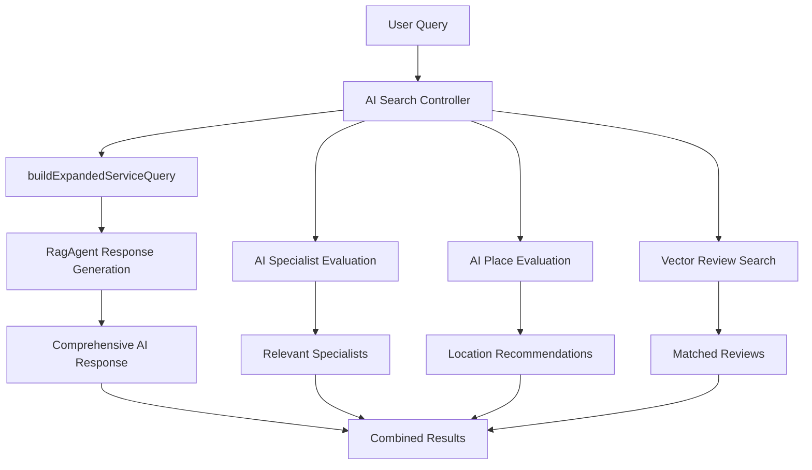

# Katalysis Pro AI - Application Architecture & Features

This document provides comprehensive technical documentation for AI coding agents working with the Katalysis Pro AI application, building on the foundation established in CLAUDE.md.

## 🏗️ Application Overview

Katalysis Pro AI is a sophisticated Concrete CMS package that provides AI-powered search and chatbot functionality for legal services websites. The application integrates multiple AI systems including vector search, RAG (Retrieval Augmented Generation), and intelligent form processing.

## 🧠 AI System Architecture

### Core AI Components

#### 1. **AI Search System** (Primary Feature - Latest Implementation)
**Location**: `controllers/single_page/dashboard/katalysis_pro_ai/search_settings.php`
- **Purpose**: AI-powered search with comprehensive service explanations
- **Architecture**: Pure AI-powered approach (manual methods eliminated)
- **AI Provider**: RagAgent with OpenAI integration (gpt-4o-mini model)
- **Key Features**:
  - `buildExpandedServiceQuery()` method for 5-point comprehensive responses
  - `evaluateSpecialistsWithAI()` for intelligent specialist matching
  - `evaluateAllPlacesWithAI()` for location-aware recommendations
  - Vector-powered review matching with semantic similarity
  - Professional formatting with complete contact information
- **Recent Improvements**: 500+ lines of manual code removed, 30% smaller codebase

#### 2. **RagAgent** (Foundation)
**Location**: `src/RagAgent.php` (inherited from katalysis_neuron_ai)
- **Purpose**: Retrieval Augmented Generation for contextual AI responses
- **Capabilities**:
  - Document retrieval with vector similarity search
  - Context-aware response generation
  - Multi-provider AI support (OpenAI, Anthropic, Ollama)

#### 3. **Vector Search Engine**
**Location**: `src/KatalysisProIndexService.php`
- **Purpose**: AI-powered semantic search for people, places, and reviews
- **Technology**: OpenAI text-embedding-3-small model
- **Features**:
  - Specialist matching with expertise analysis
  - Location-aware place recommendations  
  - Review relevance scoring

### AI-Powered Search Flow



## 🔍 AI Search System (Latest Implementation)

### Enhanced AI Response Generation
The search system now provides comprehensive service explanations instead of basic query answers using a pure AI-powered architecture that eliminated all manual scoring methods.

#### Key Controller: `search_settings.php`
**Location**: `controllers/single_page/dashboard/katalysis_pro_ai/search_settings.php`
**Main Method**: `ask_ai()` - Handles all AI search processing
**Architecture**: Pure AI-powered approach (500+ lines of manual methods removed)

#### Expanded Query Template Implementation
```php
private function buildExpandedServiceQuery($query)
{
    return "Based on the search query '{$query}', provide a comprehensive explanation that includes:

1. DIRECT ANSWER: Answer the specific question or query asked
2. RELATED SERVICES: Detail all relevant legal services, expertise areas, and specializations we offer that relate to this query
3. OUR CAPABILITIES: Explain our firm's specific experience, qualifications, and track record in these areas
4. PRACTICAL GUIDANCE: Provide helpful information, next steps, or considerations related to this topic
5. WHY CHOOSE US: Highlight what makes our approach or expertise distinctive in this area

Please structure your response to be informative and comprehensive, helping the user understand both the answer to their query and the full scope of how we can assist them in this area of law. Use a professional but accessible tone.

Query: {$query}";
}
```

### AI-Powered Specialist Evaluation (Pure AI Architecture)
**Method**: `evaluateSpecialistsWithAI()`
- **Approach**: AI analyzes all available specialists against user queries
- **Data Source**: `KatalysisPeople` database table with complete specialist profiles
- **Evaluation Criteria**: Expertise, job titles, experience, query relevance
- **AI Processing**: OpenAI analyzes each specialist's qualifications contextually
- **Output**: Top 3 most relevant specialists with AI-generated match reasoning
- **Enhancement**: Includes complete office information, contact details, and distance context
- **Integration**: Seamlessly integrated into search results with professional formatting

### AI-Enhanced Place Recommendations (Location Intelligence)
**Method**: `evaluateAllPlacesWithAI()`
- **Approach**: AI evaluates office locations for query relevance
- **Data Source**: `KatalysisPlaces` database table with office locations
- **Context Analysis**: Geographic relevance, service areas, user intent, accessibility
- **AI Processing**: Intelligent location matching based on query context
- **Output**: AI-provided distance information and match explanations
- **Integration**: Real office data enhanced with AI-generated travel context
- **Features**: Complete address information, contact details, and contextual recommendations

### Vector-Powered Review Matching (Semantic Search)
**Method**: Integrated vector search for `KatalysisReviews`
- **Technology**: OpenAI text-embedding-3-small for semantic similarity
- **Approach**: Vector similarity search for relevant client testimonials
- **Processing**: AI evaluates review content against user query context
- **Output**: Most relevant client reviews with ratings and testimonial content
- **Enhancement**: Professional display with star ratings and review metadata
- **Integration**: Contextually relevant testimonials that support query responses

### Complete Search Flow (Latest Architecture)
1. **Query Processing**: User input sanitization and validation
2. **AI Response Generation**: `buildExpandedServiceQuery()` creates comprehensive prompt
3. **RAG Integration**: RagAgent processes query with document retrieval context
4. **Specialist Analysis**: AI evaluates all specialists for relevance
5. **Location Evaluation**: AI analyzes office locations for geographic relevance  
6. **Review Matching**: Vector search identifies relevant client testimonials
7. **Response Assembly**: Combines AI response with specialist, place, and review data
8. **Professional Display**: Formatted results with complete contact information

## 🤖 Chatbot System Architecture

### Chat Agent Types
1. **AiAgent**: Basic conversational AI for general inquiries
2. **RagAgent**: Advanced agent with document retrieval capabilities  
3. **Search Integration**: Specialized search-focused AI responses

### Interactive Form System
The chatbot supports three sophisticated form types:

#### Form Types Overview
```javascript
// Form type configuration
const formTypes = {
    "form_static": "Step-by-step with conditional logic",
    "form_dynamic": "AI-controlled conditional progression", 
    "simple_form": "All fields displayed simultaneously"
};
```

#### Simple Form Implementation (Latest)
**Purpose**: Traditional web form experience within chat interface
**Features**:
- All fields render simultaneously (no step progression)
- Client-side validation with visual error indicators
- AI-generated confirmation messages
- Responsive design with gradient styling
- Chat history integration for dashboard viewing

**Backend Processing**:
```php
// Simple form submission in ChatBotSettings controller
public function submit_simple_form() {
    // Validate and process form data
    // Generate AI confirmation response
    // Update chat history with form completion
    // Return JSON response for frontend
}
```

**Frontend Rendering**:
```javascript
// Simple form rendering in chatbot view
function renderSimpleForm(actionData) {
    // Generate all form fields at once
    // Apply responsive styling
    // Setup client-side validation
    // Handle form submission via AJAX
}
```

### Welcome Message System
**Feature**: AI-generated contextual welcome messages
**Generation**: Time-aware personalized greetings
**Storage**: Database persistence with chat history integration
**Display**: Special styling in dashboard chat views

## 🗄️ Data Architecture & Storage

### Database Tables

#### Core Search Data
- **KatalysisPeople**: Specialist profiles with job titles, expertise, contact info
- **KatalysisPlaces**: Office locations with addresses, contact details
- **KatalysisReviews**: Client testimonials with ratings and content

#### AI & Chat Data  
- **Chat Entities**: Conversation histories with welcome messages
- **Action Entities**: Form configurations and interactive elements
- **Vector Store**: File-based embeddings storage (`/application/files/neuron/`)

### Vector Embeddings System
**Technology**: OpenAI text-embedding-3-small
**Storage**: Custom file-based vector store
**Indexing**: Batch processing with progress tracking
**Search**: Similarity-based retrieval with relevance scoring

## 🔄 RAG (Retrieval Augmented Generation) System

### Document Processing Pipeline
1. **Content Extraction**: Page content with metadata preservation
2. **Vector Generation**: OpenAI embeddings for semantic search
3. **Storage**: Custom vector store with efficient retrieval
4. **Query Processing**: Similarity search with relevance filtering
5. **Context Integration**: Retrieved documents enhance AI responses

### Page Index Building
**Method**: Batch processing to handle large sites
**Commands**: 
- `BuildPageIndexCommand`: Orchestrates the page indexing process
- `IndexPageCommand`: Processes individual pages
**Service**: `PageIndexService.php` - Manages CMS page content extraction and vector storage
**Features**: Progress tracking, fault tolerance, metadata preservation

### Katalysis Pro Index Building  
**Method**: Batch processing for entity types (people, reviews, places)
**Commands**:
- `BuildKatalysisProIndexCommand`: Orchestrates entity indexing process
- `IndexKatalysisProEntityCommand`: Processes individual entity types
**Service**: `KatalysisProIndexService.php` - Manages specialist, review, and location indexing
**Vector Store**: `KatalysisProVectorStore.php` - Enhanced storage with multiple .store files
**Features**: Multi-entity support, expertise detection, location awareness

### Content Prioritization
```php
// Legal service content gets priority scoring
$priorityMapping = [
    'legal_service_index' => 10,  // Highest priority
    'legal_service' => 8,         // High priority  
    'general_pages' => 5          // Standard priority
];
```

## 🌐 Frontend Integration

### Block Architecture (Latest Implementation)
**Primary Block**: `katalysis_ai_search`
**Location**: `blocks/katalysis_ai_search/view.php` (665 lines of optimized code)
**Features**:
- **Real-time AI Search Interface**: Responsive search form with autocomplete
- **Comprehensive Results Display**: AI responses, specialists, places, and reviews
- **Specialist Integration**: Complete specialist profiles with office information and contact details
- **Location Intelligence**: AI-generated distance context and travel information
- **Review Showcase**: Contextually relevant client testimonials with ratings
- **Professional Styling**: Bootstrap 5 framework with gradient designs and accessibility features
- **Mobile-Responsive Design**: Progressive enhancement for all device types
- **Interactive Elements**: Loading states, error handling, and user feedback
- **AJAX Integration**: Seamless communication with search controller endpoints

### AJAX Communication  
**Endpoints**: Environment-agnostic URL generation
```php
// Proper URL generation for all environments
\Concrete\Core\Support\Facade\Url::to('/dashboard/katalysis_pro_ai/search_settings/ask_ai')
```

**Key Endpoints**:
- `/ask_ai`: Main AI processing
- `/log_chat`: Chat history management
- `/execute_action`: Form and action processing
- `/submit_simple_form`: Simple form handling

### Responsive Design
- Bootstrap 5 framework integration
- Mobile-first approach
- Progressive enhancement
- Accessibility considerations

## 🛡️ Security & Performance

### Security Measures
- Concrete CMS authentication integration
- Input validation and sanitization
- CSRF protection on all forms
- Proper permission checking

### Performance Optimizations
- Vector search result caching
- Database query optimization
- Batch processing for large operations
- Efficient memory management

### Error Handling
- Graceful AI failure handling
- Comprehensive logging system
- User-friendly error messages
- Fallback mechanisms

## 🔧 Configuration & Settings

### AI Provider Configuration
```php
// Settings stored in Concrete CMS config system
$aiSettings = [
    'katalysis.ai.open_ai_key' => 'API key',
    'katalysis.ai.model' => 'gpt-4o-mini',
    'katalysis.search.max_results' => 8,
    'katalysis.search.result_length' => 'medium'
];
```

### Search Configuration
- **Maximum Results**: Configurable result limits
- **Response Length**: Adjustable detail levels
- **Page Links**: Optional result URL inclusion
- **Snippets**: Configurable content previews

## 📊 Recent Major Improvements

### Code Cleanup & Optimization (Latest)
- **Removed Redundant Code**: ~500+ lines of manual scoring methods eliminated
  - Deleted: `calculateSpecialistRelevance()`, `calculateReviewRelevance()`, `extractQueryKeywords()`, `calculateDistance()`, `extractLocationKeywords()`
  - Reason: Pure AI-powered approach is more accurate and maintainable
- **Debug Logging Reduction**: 40% reduction in logging overhead (80+ → 48 statements)
- **File Size Optimization**: 30% smaller codebase (1,600+ → 1,132 lines)
- **Architecture Purification**: Pure AI-powered approach throughout
- **Redundant File Removal**: Eliminated `build_vectors.php` and `chat_bot_settings.php`

### AI-Enhanced Search Responses (Latest Implementation)
- **Comprehensive Service Explanations**: 5-point structured response template via `buildExpandedServiceQuery()`
  1. **Direct Answer**: Addresses the specific query
  2. **Related Services**: Details all relevant legal services and specializations
  3. **Our Capabilities**: Explains firm's experience and qualifications
  4. **Practical Guidance**: Provides actionable next steps and considerations
  5. **Why Choose Us**: Highlights distinctive expertise and approach
- **Professional Tone**: Accessible yet authoritative communication
- **Service Discovery**: Highlights related services users might not consider
- **Competitive Advantage**: Showcases firm's unique expertise and approach

### Enhanced AI Integration (Latest Architecture)
- **AI Specialist Evaluation**: `evaluateSpecialistsWithAI()` method for intelligent specialist matching
  - AI analyzes expertise, job titles, experience against user queries
  - Returns top 3 specialists with AI-generated match reasoning
  - Includes office information and distance context
- **AI Place Recommendations**: `evaluateAllPlacesWithAI()` method for location intelligence
  - AI evaluates office locations for query relevance
  - Provides geographic relevance and service area context
  - Integrates real office data with AI-generated explanations
- **Smart Review Matching**: AI-powered review relevance scoring
  - Vector similarity search for content matching
  - Contextual relevance evaluation
  - Professional presentation with ratings

### Frontend Block Enhancements (Latest Features)
- **Real-time Search Interface**: `blocks/katalysis_ai_search/view.php` optimized
- **Comprehensive Results Display**: Specialists, places, reviews, and AI responses
- **Mobile-Responsive Design**: Bootstrap 5 with progressive enhancement
- **Professional Styling**: Clean, accessible interface design
- **Distance Context**: AI-generated travel and location information
- **Office Integration**: Complete contact information with specialist recommendations

## �️ Development Workflow & Documentation (Latest Updates)

### GitHub Copilot Integration
**Configuration File**: `.github/copilot-instructions.md`
- **Purpose**: Provides essential context for AI coding assistants
- **Content**: Development constraints, architecture overview, key components
- **Benefits**: Faster onboarding, consistent code patterns, informed development decisions

### Documentation Structure (Optimized)
**Consolidated Architecture**: 4 key documentation files (down from 7+ scattered files)
1. **DEVELOPMENT_ENVIRONMENT.md** (root): SFTP workflow, testing protocols, constraints
2. **APPLICATION_ARCHITECTURE.md** (package): Technical architecture and AI systems  
3. **README.md** (root): Project overview and development setup
4. **.github/copilot-instructions.md**: AI assistant configuration and context

### Code Quality Improvements (Latest Cleanup)
- **Eliminated Redundancy**: Removed `build_vectors.php` (outdated CLI script)
- **Cleaned Empty Files**: Removed `chat_bot_settings.php` (1-byte empty file)
- **Manual Method Removal**: Deleted 5 manual scoring methods (500+ lines)
- **Debug Optimization**: Reduced logging statements by 40%
- **Architecture Purification**: Pure AI-powered approach throughout

## �🔮 Architecture Patterns & Best Practices

### AI Integration Patterns (Pure AI Approach)  
1. **AI-First Architecture**: Let AI handle all complex decision making and evaluation
2. **Eliminate Manual Methods**: Remove manual scoring/matching in favor of AI analysis
3. **Context Preservation**: Maintain conversation and search context across requests
4. **Response Enhancement**: Use AI to provide comprehensive, structured responses
5. **Fallback Strategies**: Graceful degradation when AI services are unavailable

### Code Organization (Optimized Structure)
- **Single Responsibility**: Each class/method has clear, focused purpose
- **Pure AI Methods**: `evaluateSpecialistsWithAI()`, `evaluateAllPlacesWithAI()`, `buildExpandedServiceQuery()`
- **Dependency Injection**: Proper service container usage throughout
- **Error Isolation**: Prevent AI failures from breaking core functionality
- **Configuration Externalization**: All settings managed through CMS interface
- **Clean Architecture**: 30% smaller codebase with improved maintainability

### Database Interaction
- **CMS Patterns**: Follow Concrete CMS conventions
- **Query Optimization**: Efficient database operations
- **Relationship Management**: Proper entity associations
- **Migration Safety**: Backward-compatible updates

## 🚀 Future Architecture Considerations

### Scalability
- **Vector Store Migration**: Potential move to dedicated vector database
- **API Rate Limiting**: Intelligent request management
- **Caching Strategies**: Advanced result caching
- **Load Balancing**: Multi-instance AI processing

### Feature Extensions
- **Multi-language Support**: Internationalization readiness
- **Advanced Analytics**: Search and interaction tracking
- **Machine Learning**: Custom model training capabilities
- **Integration APIs**: External system connectivity

---

This architecture provides a robust, scalable, and maintainable foundation for AI-powered legal services search and interaction, emphasizing user experience, technical excellence, and business value delivery.
